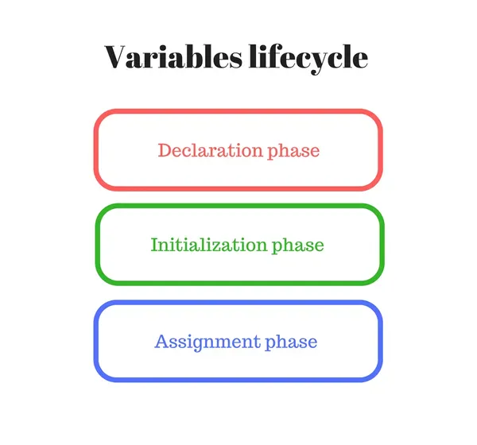
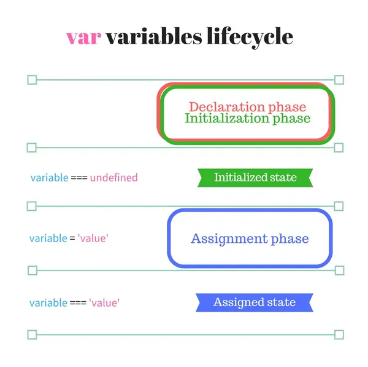
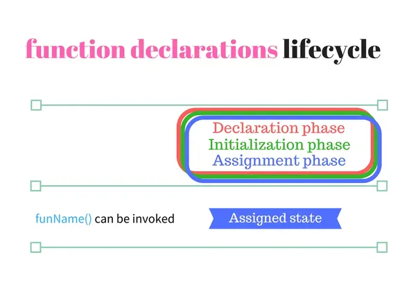
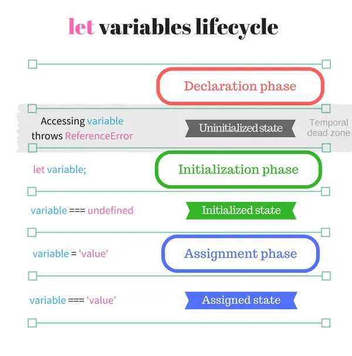

* content
{:toc}

> 英文原文：[JavaScript Variables Lifecycle: Why let Is Not Hoisted](https://dmitripavlutin.com/variables-lifecycle-and-why-let-is-not-hoisted/)
>
> 原文作者：[Dmitri Pavlutin](https://dmitripavlutin.com/)
>
> 原文日期：2016-07-27

提升是将变量或函数定义虚拟地移动到作用域的开头的过程，通常对于变量语句 `var` 和函数声明 `function fun() {...}`。

当 ES2015 引入 `let`（以及与 `let` 具有相似声明行为的 `const` 和 `class`）声明时，包括我在内的许多开发人员都在使用提升（hoisting）定义来描述变量如何被访问。但是，在对该问题进行了更多搜索之后，令我惊讶的是，提升不是描述 `let` 变量的初始化和可用性的正确术语。

ES2015 为 `let` 提供了一种不同的改进机制。它要求更严格的变量声明实践（定义前不能使用），从而提高代码质量。 

让我们深入了解有关此过程的更多信息。

# 1. 容易出错的变量提升

有时，在作用域内的任何位置，我都能见到变量 `var varname` 和函数 `function funName() {...}` 声明的怪异实践：

```js
// 变量提升
num;     // => undefined
var num;
num = 10;
num;     // => 10
// 函数提升
getPi;   // => function getPi() {...}
getPi(); // => 3.14
function getPi() {
  return 3.14;
}
```

在声明 `var num` 之前访问变量 `num`，因此将其计（evaluate）为 `undefined`。函数 `function getPi() {...}` 在文件末尾定义。但是，该函数可以在声明 `getPi()` 之前调用，因为它已提升到作用域的顶部。

这就是经典的提升。

事实证明，先使用然后声明变量或函数的可能性会引发混乱。假设您滚动一个大文件却突然看到一个未声明的变量……它在这里到底是怎么出现的以及在何处定义？ 当然，有经验的 JavaScript 开发人员不会采用这种方式进行编码。但是在成千上万的 JavaScript GitHub 仓库中很可能会应付这种代码。

即使查看上面提供的代码示例，也很难理解代码中的声明流程。

自然地，首先您要声明或描述一个未知项。而且只有稍后才使用它。`let` 鼓励您对变量采用这种方法。

# 2. 背后原理：变量生命周期

当引擎使用变量时，它们的生命周期包括以下几个阶段：

1. **声明阶段**是指在作用域内注册变量。 
2. **初始化阶段**是指分配内存并为作用域中的变量创建绑定。在此步骤中，变量将自动使用 `undefined` 初始化。 
3. **赋值阶段**是指为已初始化的变量赋值。

变量在通过声明阶段时处于**未初始化**状态，但尚未达到初始化阶段。



注意，就变量生命周期而言，*声明阶段*与一般而言的*变量声明*是不同的术语。简而言之，引擎在 3 个阶段处理变量声明：声明阶段、初始化阶段和赋值阶段。

# 3. var变量生命周期

熟悉了生命周期阶段，让我们用其来描述引擎如何处理 `var` 变量。



假设一个场景，JavaScript 遇到一个内部带有 `var variable` 语句的函数作用域。在执行任何语句之前（步骤 1），变量会在作用域的开头通过*声明阶段*并立即进行*初始化阶段*。 `var variable` 语句在函数作用域中的位置不影响声明和初始化阶段。

在声明和初始化之后，但在赋值阶段之前，该变量具有 `undefined` 的值，并且已经可以使用。

在*赋值阶段*，`variable = 'value'` 中变量将接收其初始值（步骤 2）。

严格来说，理论上，*提升*是指在函数作用域的*开头声明和初始化*变量。声明和初始化阶段之间没有间隙。[^1]

让我们研究一个例子。以下代码创建一个函数作用域，并在其中包含 `var` 语句：

```js
function multiplyByTen(number) {
  console.log(ten); // => undefined
  var ten;
  ten = 10;
  console.log(ten); // => 10
  return number * ten;
}
multiplyByTen(4); // => 40
```

当 JavaScript 开始执行 `multipleByTen(4)` 并进入函数作用域时，变量 `ten` 在第一个语句之前即通过声明和初始化步骤。因此，在调用 `console.log(ten)` 时，记录为 `undefined`。`ten = 10` 语句会赋初值。赋值后，`console.log(ten)` 行正确记录了值 `10`。

# 4. 函数声明生命周期

*函数声明语句* `function funName() {...}` 的情况，甚至更为简单。



*声明、初始化和赋值阶段*在封闭函数作用域的开头立即发生（仅一步）。`funName()` 可以在作用域内任何位置调用，而不依赖于声明语句的位置（甚至可以在末尾）。

下面的代码示例演示了函数提升：

```js
function sumArray(array) {
  return array.reduce(sum);
  function sum(a, b) {
    return a + b;
  }
}
sumArray([5, 10, 8]); // => 23
```

当 JavaScript 执行 `sumArray([5，10，8])` 时，它将进入 `sumArray` 函数作用域。在此作用域内，在执行任何语句之前，`sum` 必须通过所有三个阶段：声明、初始化和赋值。

这样 `array.reduce(sum)` 甚至可以在其声明语句 `function sum(a，b) {...}` 之前使用 `sum`。

# 5. let变量生命周期

`let` 变量的处理方式与 `var` 不同。主要区别是声明和初始化阶段是分开的。



现在让我们研究一下解释器进入包含 `let variable` 语句的块作用域的情况。变量立即通过*声明阶段*，在作用域内注册其名称（步骤 1）。 

然后，解释器继续逐行解析块语句。

如果您在此阶段尝试访问 `variable`，则 JavaScript 将抛出 `ReferenceError: 变量未定义`。这是因为变量状态是*未初始化*。 `variable` 位于*暂时性死区（temporal dead zone）*。

当解释器到达语句 `let variable` 时，将通过初始化阶段（步骤 2）。现在，变量状态为*已初始化*，对其进行访问将得到 `undefined`。变量退出*暂时性死区*。

之后，当赋值语句出现 `variable = 'value'`，将通过赋值阶段（步骤 3）。

如果 JavaScript 遇到 `let variable = 'value'`，则初始化和赋值将在单个语句中发生。

让我们来看一个例子。在块作用域内创建 `let` 变量 `number`：

```js
let condition = true;
if (condition) {
  // console.log(number); // => Throws ReferenceError
  let number;
  console.log(number); // => undefined
  number = 5;
  console.log(number); // => 5
}
```

当 JavaScript 进入 `if (condition) {...}` 块作用域时，`number` 立即通过声明阶段。

因为 `number` 具有未初始化状态并且处于暂时性死区，所以尝试访问该变量将抛出 `ReferenceError：number 未定义`。之后，语句 `let number` 进行初始化。现在可以访问该变量了，但是其值为 `undefined`。 

赋值语句 `number = 5` 当然会进入赋值阶段。

除了赋值只能发生一次外，`const` 和 `class` 类型与 `let` 具有相同的生命周期。

## 5.1 为什么在let生命周期中提升无效

如上所述，*提升*是变量在作用域顶部*耦合（couple）*声明和初始化。但是 `let` 生命周期中声明和初始化阶段*解耦（decouple）*了。解耦使得对于 `let` 而言提升术语不复存在。 

这两个阶段之间的间隙创建了暂时性死区，无法访问该变量。

在科幻风格中，在 `let` 生命周期中崩溃的提升创建了暂时性死区。

# 6. 总结

使用 `var` 声明变量易于出错。 

基于此课程，ES2015 引入了 `let`。它使用一种改进的算法来声明变量，并且具有块作用域。

因为声明和初始化阶段解耦，所以提升对于 `let` 变量（包括 `const` 和`class`）无效。在初始化之前，该变量处于暂时性死区中并且不可访问。

为了使变量声明保持流畅性，建议使用以下技巧：

* 声明、初始化然后再使用变量。此流程正确且易于遵循。
* 使变量尽可能隐藏。暴露的变量越少，代码就越模块化。

今天就这些了。在下一篇文章中见。

---

[^1]: 这里指声明和初始化阶段是连续而又不可分割的两个阶段。换句话说，声明必将伴随初始化。