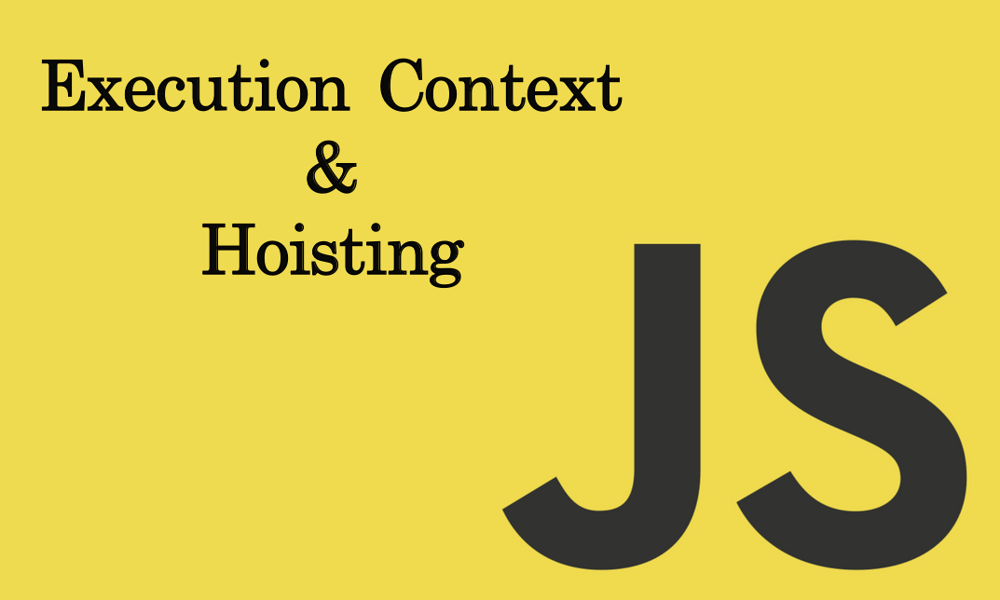
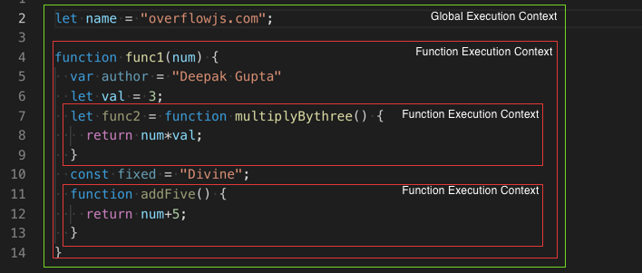
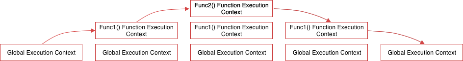

* content
{:toc}

> 英文原文：[Javascript Execution Context and Hoisting](https://towardsdatascience.com/javascript-execution-context-and-hoisting-c2cc4993e37d)
>
> 原文作者：[Deepak Gupta](https://towardsdatascience.com/@ideepak.jsd)
>
> 原文日期：2019-08-06



本文是为那些不知道JavaScript是如何执行的人而作。

预备知识：你应该知道

1. [Javascript 中的作用域](https://medium.com/@ideepak.jsd/still-confused-in-js-scopes-f7dae62c16ee?)
2. [Javascript 中的关键字](https://medium.com/@ideepak.jsd/javascript-context-this-keyword-9a78a19d5786?)
3. [计算机中的堆栈](https://en.wikipedia.org/wiki/Stack_(abstract_data_type))

在我们开始前你能回答以下问题吗？

# Javascript是一个解释型还是编译型语言？

是的，Javascript（JS）是一种解释语言，还有自己的编译器，运行在所谓的 Javascript 引擎中。

尽管有相同的目的，但每个网络浏览器都有自己的 JavaScript 引擎。例如，Chrome 有 v8 而 Mozilla 有 spider monkey 等等。Javascript 引擎只是将 Javascript 源代码转换为编译器可以理解的语言，然后执行它。

让我们开始吧，

# 执行上下文

Javascript 代码运行环境是一个执行上下文。

执行上下文决定哪些特定代码块可以访问变量、函数，对象等等。

如果你已经阅读了那篇关于作用域的文章，那么你应该知道什么是全局作用域和局部作用域（函数作用域）。

因此，执行上下文有不同的类型 ——

## 1. 全局执行上下文

每当代码第一次运行时，或者当代码不在任何函数内时，它就进入全局执行上下文。在整个代码执行过程中只有一个全局执行上下文。

在浏览器的场景下，全局执行上下文会做 2 件事

1. 创建一个 window 对象
2. this 关键字引用该 window 对象

## 2. 函数执行上下文

每当代码执行发现一个函数时，它就创建一个新的函数执行上下文。可以有任意数量的函数执行上下文。



如上，全局执行上下文包含 name 变量和对 func1 的函数引用。而包含变量和函数引用的三个函数执行上下文将被创建。详细信息将在文章中进一步解释。

# 执行堆栈/调用堆栈

Javascript 在浏览器中一个时刻只能做一件事，这意味着它是单线程的，因此它在所谓的执行堆栈中对其他操作、事件和函数进行排队。

每当在浏览器中加载脚本时，堆栈中的第一个元素是全局执行上下文。但是，当一个函数执行时，会创建一个执行上下文，并将其置于全局执行上下文之上。一旦一个函数执行完成，它就会从执行堆栈中弹出，并将控制权返还给它下面的上下文。

让我们举个例子，想象一下上面的情况。




> 步骤一：当上面的代码在浏览器中加载时，Javascript 引擎会创建一个全局执行上下文并将其推入当前执行堆栈。
>
> 步骤二：假设最终我们调用一下 func1()，然后 Javascript 引擎为该函数创建一个新的执行上下文，并将其推到全局执行上下文的之上。
>
> 步骤三：在 func1() 内部，我们有调用 func2()，因此，Javascript 引擎会为该函数创建一个新的执行上下文，并将其推到 func1 执行上下文之上。
>
> 步骤四：当 func2() 函数结束时，它的执行上下文将从当前堆栈弹出，且控制权转移到其下的执行上下文，即 func1() 函数的执行上下文。
>
> 步骤五：当 func1() 函数结束时，它的执行堆栈将从堆栈中移除，并且控制权转移到全局执行上下文。一旦所有的代码都执行了，Javascript 引擎将从当前堆栈移除全局执行上下文。

# 执行上下文阶段

执行上下文主要有两个阶段。

1. 创建
2. 执行

让我们一个一个来看。

## 创建阶段

在函数执行之前会发生几件事。

1. 首先，为形成作用域链的每个函数或变量创建到外部环境的连接。 这告诉执行上下文它应该包含什么以及在哪里查找解析函数引用和变量值。

* 对于全局环境，外部环境为 null。但是，全局环境中的所有环境都将全局环境作为它的外部环境。
* 如果函数 a 包含在函数 b 中，这意味着 a 有一个外部环境 b。

2. 扫描作用域链后，将创建一个环境记录，其中在内存中完成了全局上下文（在网络浏览器中是一个窗口）、变量、函数和函数参数的创建和引用。

3. 最后，在第一步中创建的每个执行上下文中确定 this 关键字的值（对于全局执行上下文，this 指向 window）。

> 注意：如果你发现 this 关键字的行为难以理解，我强烈建议你阅读[这里](https://overflowjs.com/posts/This-keyword-In-Javascript-2019-Javascript-Context.html)。

因此，我们可以将创建阶段表示为

```js
creationPhase = {
'outerEnvironmentConnection': {
        /* scope chain resolution*/ 
    },    
'variableObjectMapping': {
        /* function arguments, parameters, inner variable and function declarations are created or referenced in memory */ 
    },
    'valueOfThis': {},
    
}
```

## 执行阶段

在此阶段，代码开始在创建阶段形成的执行上下文中运行，并逐行为变量赋值。

在执行开始时，引擎会在其创建阶段对象中查找引用以执行函数。 如果在它自己的作用域中找不到，它将继续沿作用域链向上移动，直到到达全局环境为止。

如果在全局环境中未找到引用，则会返回一个错误。但是，如果找到了一个引用，并且函数正确地执行了，则该函数的执行上下文将会从堆栈中弹出，并且引擎会移动到下一个函数，这时其其执行上下文将加入堆栈并执行，以此类推。

让我们通过示例来看看以上两个阶段，以更好地了解它。


在创建阶段，全局执行上下文将看起来像这样：

```js
globalExecutionObj = {
    outerEnvironmentConnection: null,
    variableObjectMapping: {
        name: uninitialized,
        title: undefined,
        date: uninitialized,
        func1: func,
    },
    this: window //Global Object
}
```

> 注意：如上，在创建阶段，`let`（name）和 `const`（date）定义的变量不会关联任何值，但是，`var`（title）定义的变量设置为了 `undefined`。

这就是为什么你能在声明之前访问 `var` 定义的变量（虽然是 `undefined`）而在声明之前访问 `let` 和 `const` 变量会得到一个引用错误的原因。

这就是所谓的提升，即所有使用 `var` 声明的变量都将提升到其函数/局部作用域的顶部（如果声明在函数内）或者是全局作用域的顶部（如果声明在一个函数外部），无论实际声明在何处。

在执行阶段中，变量赋值完成。因此在执行阶段，全局执行上下文看起来像这样。

```js
globalExectutionObj = {
    outerEnvironmentConnection: null,
    variableObjectMapping: {
        name: "overflowjs.com",
        title: "Execution context",
        date: "5 july 2019",
        func1: pointer to function func1,
    },
    this: window //Global Object
}
```

注意：执行阶段，如果在源代码中，Javascript 引擎没有在 `let` 变量实际声明的位置找到其值，将赋值为 `undefined`  。

现在，当到达 func1 时，一个新的函数执行上下文将产生，其创建对象看起来如下

```js
func1ExecutionObj = {
    outerEnvironmentConnection: Global,
    variableObjectMapping: {
       arguments: {
            0: 10,
            length: 1
        },
        num: 10,

        author: undefined,
        val: uninitialized,
        func2: undefined
        fixed: uninitialized
        addFive: pointer to function addFive()
    },
    this: Global Object or undefined
}
```

执行阶段，

```js
func1ExecutionObj = {
    outerEnvironmentConnection: Global,
    variableObjectMapping: {
       arguments: {
            0: 10,
            length: 1
        },
        num: 10,

        author: "Deepak",
        val: 3,
        func2: pointer to function func2() 
        fixed: "Divine"
        addFive: pointer to function addFive()
    },
    this: Global Object or undefined
}
```

在函数完成了其执行后，全局环境将更新。然后全局代码完成，程序结束。

---

如果你希望被添加到我的电子邮件列表中，并在 [medium](https://medium.com/@ideepak.jsd) 关注我以便阅读更多有关 Javascript 的文章，以及在 github 上查看我的疯狂代码，请考虑[在此处输入您的电子邮件](https://goo.gl/forms/MOPINWoY7q1f1APu2)。如果有任何不清楚的或你想提出一些问题，请在下方留言。

你也可能会喜欢我的其他文章

1. [Javascript — Generator-Yield/Next & Async-Await 🤔](https://medium.com/datadriveninvestor/javascript-generator-yield-next-async-await-8442d2c77185)
2. [Javascript data structure with map, reduce, filter](https://levelup.gitconnected.com/write-beautiful-javascript-with-λ-fp-es6-350cd64ab5bf)
3. [Javascript- Currying VS Partial Application](https://medium.com/datadriveninvestor/javascript-currying-vs-partial-application-4db5b2442be8)
4. [Javascript ES6 — Iterables and Iterators](https://medium.com/datadriveninvestor/javascript-es6-iterables-and-iterators-de18b54f4d4)
5. [Javascript — Proxy](https://medium.com/datadriveninvestor/why-to-use-javascript-proxy-5cdc69d943e3)

谢谢！