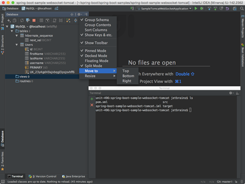
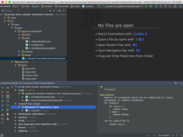

**从Eclipse迁移到IntelliJ IDEA**

> 英文原文：[Migrating From Eclipse to IntelliJ IDEA](https://www.jetbrains.com/help/idea/migrating-from-eclipse-to-intellij-idea.html)

# 概述

从Eclipse切换到IntelliJ IDEA，尤其是当你已经使用了很久的Eclipse，需要了解这两个IDE之间的一些基本差异，包括它们的用户界面、编译方法、快捷方式、项目配置和其他方面。

# 用户界面

## 没有工作空间

启动IntelliJ IDEA时你将注意到的第一件事是，它没有工作空间的概念。这意味着你只能在一个工程下工作。而在Eclipse中你通常有一组彼此依赖的工程，在IntelliJ IDEA中你只有唯一的一个由一组模块组成的工程。

如果你有几个不相关的项目，你可以在不同的窗口中打开它们。

如果你仍然希望在一个窗口中打开几个不相关的项目，作为一个解决方案，你可以将它们全部配置为IntelliJ IDEA的模块。

## IntelliJ IDEA vs Eclipse术语

下表比较了IntelliJ IDEA和Eclipse术语： 

| **Eclipse**       | **IntelliJ IDEA** |
| ----------------- | ----------------- |
| Workspace         | Project           |
| Project           | Module            |
| Facet             | Facet             |
| Library           | Library           |
| JRE               | SDK               |
| Classpathvariable | Path variable     |

##	没有透视图

当你切换到IntelliJ IDEA时，第二个大惊喜是它没有透视图。

这意味着您不需要手动切换不同的工作区布局，以执行不同的任务。IDE跟随你的上下文，并自动提供相关工具。


##	工具窗口

就像在Eclipse中一样，在IntelliJ IDEA中也有工具窗口。要打开一个工具窗口，只需在工具窗口栏中简单地单击它。 


如果工具窗口栏是隐藏的，你可以通过在左下角的相应图标上悬停，打开任何工具窗口。


如果你想让工具窗口栏可见片刻，你可以按Alt键(macOS按Cmd键)两次并按住。

如果你不想使用鼠标，可以通过按指定的快捷键切换到任何工具栏。要记住最重要的快捷键是：

* Project: Alt+1
* Version Control: Alt+9
* Terminal: Alt+F12

关于工具窗口的另一件事是你可以拖拽、钉住、解钉、依附和分离它们： 



为了帮助存储/恢复工具窗口的布局，有两个有用的命令：

* Window | Store Current Layout as Default
* Window | Restore Default Layout(also available via Ctrl+F12)

## 多窗口

在IntelliJ IDEA中，窗口管理与Eclipse略有不同。你不能为一个工程打开多个窗口，但是你可以分离任意数量的编辑器选项卡到单独的窗口中。

##  自动滚动到/自源代码

默认情况下，当你在编辑器选项卡之间切换时，IntelliJ IDEA 不会改变工程工具窗口中的选择。但是，你可以在工具窗口设置中启用它：


## 显示行号

默认情况下，在编辑器中没有显示行号。要启用它们，转到Settings/Preferences | Editor | General | Appearance | Show line numbers。在那里你还可以找到其他有用的设置。

# 一般工作流

## 没有“保存”按钮

有一些令人震惊的消息：IntelliJ IDEA没有“保存（Save）”按钮。由于在IntelliJ IDEA可以撤销重构，并从本地历史（[Local History](https://www.jetbrains.com/help/idea/local-history.html)）恢复更改，所以每次都要求你保存更改是没有意义的。

不过，值得了解的是，对磁盘的物理存储是由某些事件触发的，包括编译、关闭文件、焦点从 IDE 中转出等等。你可以通过 Settings | Appearance & Behavior | System Settings 更改该行为：


## 没有保存动作

作为Eclipse用户，在IntelliJ IDEA中你可能会丧失的一个特性是保存操作，例如，在保存时自动触发的操作，比如格式化代码、组织导入、添加缺失的注释和final修饰符等等。取而代之的是，IntelliJ IDEA提供在提交时自动运行相应的操作：


或者手动执行：

Code | Reformat Code(Ctrl+Alt+L)

Code | Optimize Imports(Ctrl+Alt+O)

Analyze | Code Cleanup

如果由于某些原因你不能忍受没有 Eclipse 保存动作，你可以安装[插件](https://plugins.jetbrains.com/plugin/7642)模拟 Eclipse 保存动作。

## 编译

在许多方面，IntelliJ IDEA编译工程的方式与Eclipse不同。

### 自动编译

默认情况下，IntelliJ IDEA不会自动编译正在保存的工程，因为通常我们不会在IntelliJ IDEA中显式地调用保存动作。

如果你想要模拟Eclipse的行为，可以调用Make Project (Ctrl+ F9)，它将保存已更改的文件并编译它们。为了方便起见，你甚至可以将快捷键Ctrl+S重新分配给Make Project。

为了启用自动编译，导航到Settings/Preferences | Build, Execution, Deployment | Compiler，然后选择Make project automatically选项：


注意，在IntelliJ IDEA中自动编译有别于Eclipse。在Eclipse中不是完全自动的，因为它是由用户直接调用的保存动作触发的，而在IntelliJ IDEA中是在你在编辑器中输入时隐式地调用的。

这就是为什么，即使自动编译（Make project automatically）选项被启用，如果至少有一个应用程序正在运行，IntelliJ IDEA也不会自动编译：它会隐式地重新加载应用程序中的类。在这种情况下，你可以调用Build | Make Project(Ctrl+F9)。

### 问题工具窗口（Problems tool window）

如果在编译设置中自动编译选项被启用，那么问题工具窗口就会出现。它显示了在工程编译过程中检测到的问题列表：


### Eclipse编译器

虽然Eclipse使用了自己的编译器，但IntelliJ IDEA使用的是与工程JDK绑定的javac编译器。如果你必须使用Eclipse编译器，那么可以导航到Settings/Preferences | Build, Execution, Deployment | Compiler | Java Compiler，并如下选择：


Eclipse和javac编译器之间最大的区别是，Eclipse编译器对错误更宽容，有时能让你运行不编译的代码。

当你在IntelliJ IDEA中需要运行带有编译错误的代码时，在你的运行配置（[run configuration](https://www.jetbrains.com/help/idea/run-debug-configurations-dialog.html)）中将Make选择替换为Make, no error check：


# 快捷键

IntelliJ IDEA的快捷键与Eclipse完全不同。
下面的表格显示了如何将常用Eclipse操作（以及它们的快捷方式）映射到IntelliJ IDEA（你可能希望将其打印出来，以便随时使用）。

| **Eclipse**                    |                            | **IntelliJ IDEA**            |                            |
| ------------------------------ | -------------------------- | ---------------------------- | -------------------------- |
| **Action**                     | **Shortcut**               | **Action**                   | **Shortcut**               |
| Code completion                | Ctrl+Space                 | Basic completion             | Ctrl+Space                 |
| -                              | -                          | Smart completion             | Ctrl+Shift+Space           |
| -                              | -                          | Statement completion         | Ctrl+Shift+Enter           |
| Quick access                   | Ctrl+3                     | Search everywhere            | Shift x 2                  |
| Maximize active view or editor | Ctrl+M                     | Hide all tool windows        | Ctrl+Shift+F12             |
| Open type                      | Ctrl+Shift+T               | Navigate to class            | Ctrl+N                     |
| Open resource                  | Ctrl+Shift+R               | Navigate to file             | Ctrl+Shift+N               |
| -                              | -                          | Navigate to symbol           | Ctrl+Shift+Alt+N           |
| Next view                      | Ctrl+F7                    | -                            | -                          |
| -                              | -                          | Recent files                 | Ctrl+E                     |
| -                              | -                          | Switcher                     | Ctrl+Tab                   |
| Quick outline                  | Ctrl+O                     | File structure               | Ctrl+F12                   |
| Move lines                     | Alt+UpDown                 | Move lines                   | Shift+Alt+UpShift+Alt+Down |
| Delete lines                   | Ctrl+D                     | Delete lines                 | Ctrl+Y                     |
| Quick fix                      | Ctrl+1                     | Show intention action        | Alt+Enter                  |
| Quick switch editor            | Ctrl+E                     | Switcher                     | Ctrl+Tab                   |
| -                              | -                          | Recent files                 | Ctrl+E                     |
| Quick hierarchy                | Ctrl+T                     | Navigate to type hierarchy   | Ctrl+H                     |
| -                              | -                          | Navigate to method hierarchy | Ctrl+Shift+H               |
| -                              | -                          | Show UML popup               | Ctrl+Alt+U                 |
| Last edit location             | Ctrl+Q                     | Last edit location           | Ctrl+Shift+Backspace       |
| Next editor                    | Ctrl+F6                    | Select next tab              | Alt+Right                  |
| Run                            | Ctrl+Shift+F11             | Run                          | Shift+F10                  |
| Debug                          | Ctrl+F11                   | Debug                        | Shift+F9                   |
| Correct indentation            | Ctrl+I                     | Auto-indent lines            | Ctrl+Alt+I                 |
| Format                         | Ctrl+Shift+F               | Reformat code                | Ctrl+Alt+L                 |
| Surround with                  | Ctrl+Alt+Z                 | Surround with                | Ctrl+Alt+T                 |
| -                              | -                          | Surround with live template  | Ctrl+Alt+J                 |
| Open declaration               | F3                         | Navigate to declaration      | Ctrl+B                     |
| -                              | -                          | Quick definition             | Ctrl+Shift+I               |
| Open type hierarchy            | F4                         | Navigate to type hierarchy   | Ctrl+H                     |
| -                              | -                          | Show UML popup               | Ctrl+Alt+U                 |
| References in workspace        | Ctrl+Shift+G               | Find usages                  | Alt+F7                     |
| -                              | -                          | Show usages                  | Ctrl+Alt+F7                |
| -                              | -                          | Find usages settings         | Ctrl+Shift+Alt+F7          |
| Open search dialog             | Ctrl+H                     | Find in path                 | Ctrl+Shift+F               |
| Occurrences in file            | Ctrl+Alt+U                 | Highlight usages in file     | Ctrl+Shift+F7              |
| Copy lines                     | Ctrl+Alt+Down              | Duplicate lines              | Ctrl+D                     |
| Extract local variable         | Ctrl+Alt+L                 | Extract variable             | Ctrl+Alt+V                 |
| Assign to field                | Ctrl+2Ctrl+F               | Extract field                | Ctrl+Alt+F                 |
| Show refactor quick menu       | Ctrl+Alt+T                 | Refactor this                | Ctrl+Shift+Alt+T           |
| Rename                         | Ctrl+Alt+R                 | Rename                       | Shift+F6                   |
| Go to line                     | Ctrl+L                     | Navigate to line             | Ctrl+G                     |
| Structured selection           | Shift+Alt+UpShift+Alt+Down | Select word at caret         | Ctrl+WCtrl+Shift+W         |
| Find next                      | Ctrl+J                     | Find next                    | F3                         |
| Show in                        | Ctrl+Alt+W                 | Select in                    | Alt+F1                     |
| Back                           | Ctrl+[                     | Back                         | Ctrl+Alt+Left              |
| Forward                        | Ctrl+]                     | Forward                      | Ctrl+Alt+Right             |

## Eclipse键映射
针对不喜欢学习新快捷方式的Eclipse用户，IntelliJ IDEA提供了一个与Eclipse的快捷方式相似的Eclipse键映射：


## 查询操作（Find action）
当你不知道某个操作的快捷方式时，试着使用查询操作特性，可以通过Ctrl+Shift+A使用。按照操作名称输入查询一个操作，查看快捷方式，或者调用：


# 代码助手

Eclipse和IntelliJ IDEA都提供了代码助手特性，比如代码补全、代码生成、快速修正、动态模板（live template）等等。

## 快速修正
在IntelliJ IDEA中应用快速修正，按Alt+Enter：


所有的快速修正都基于Settings | Inspections中的检查配置：


如果你想一次性将一个快速修复应用到多个地方（例如，一个完整的文件夹、模块甚至一个项目），你可以通过运行相应的检查Analyze | Run Inspection By Name，或者运行所有的批量检查Analyze | Inspect Code：



除了直接的问题之外，IntelliJ IDEA也可通过所谓的intention来识别可改进或优化的代码结构（也可以使用Alt+Enter)：


| **Eclipse** |              | **IntelliJ IDEA**     |              |
| ----------- | ------------ | --------------------- | ------------ |
| **Action**  | **Shortcut** | **Action**            | **Shortcut** |
| Quick fix   | Ctrl+1       | Show intention action | Alt+Enter    |

## 生成代码
生成代码的关键操作是Code | Generate，可通过Alt+Insert访问：


这个操作是对上下文敏感的，不仅在编辑器中，而且在工程工具窗口和导航栏中也可用：


## 代码补全

IntelliJ IDEA提供了几种不同的代码补全方式，包括：

* Basic completion

* Second basic completion

* Smart completion

* Second smart completion

* Statement completion

要了解更多这些补全方式之间的差异，请参考以下内容：

[Top 20 Features of Code Completion in IntelliJ IDEA](http://jetbrains.dzone.com/articles/top-20-code-completions-in-intellij-idea)

默认情况下，IntelliJ IDEA不会显示所选项的文档弹出窗口，但可以在Settings/Preferences | Editor | Code Completion | Autopopup documentatoin in (ms)启用：


如果你不想启用这个选项，那么当需要的时候通过按Ctrl+Q手动调用这个弹出框：


当光标位于方法或构造器的括号内时，你可以通过Ctrl+P调用Parameter Info获取有关参数的信息：


| **Eclipse**     |              | **IntelliJ IDEA**    |                  |
| --------------- | ------------ | -------------------- | ---------------- |
| **Action**      | **Shortcut** | **Action**           | **Shortcut**     |
| Code completion | Ctrl+Space   | Basic completion     | Ctrl+Space       |
| -               | -            | Smart completion     | Ctrl+Shift+Space |
| -               | -            | Statement completion | Ctrl+Shift+Enter |

## 模板
你可能习惯于在编辑器中输入main，然后调用代码补全，使其转换为main方法定义。但是，IntelliJ IDEA模板有点不同：

| **Template**                                  | **Eclipse**      | **IntelliJ  IDEA** |
| --------------------------------------------- | ---------------- | ------------------ |
| Define a main method                          | **main**         | **psvm**           |
| Iterate over an array                         | **for**          | **itar**           |
| Iterate over a collection                     | **for**          | **itco**           |
| Iterate over a list                           | **for**          | **itli**           |
| Iterate over an iterable using foreach syntax | **foreach**      | **iter**           |
| Print to System.out                           | **sysout**       | **sout**           |
| Print to System.err                           | **syserr**       | **serr**           |
| Define a static field                         | **static_final** | **psf**            |

可用模板的列表可以在Settings/Preferences | Editor | Live Templates中找到。在这里，你还可以添加自己的模板或修改现有的模板。

IntelliJ IDEA推荐代码补全结果的模板，可快速扩展任何模板而不是简单地通过按Tab键来使用代码补全。

## 后缀模板
除了“常规”模板之外，IntelliJ IDEA还提供了所谓的后缀模板。当你想要将模板应用到已经输入的表达式时，它们非常有用。例如，键入一个变量名，添加.ifn然后按下Tab键，IntelliJ IDEA将把你的表达式转换为一个if(…==null){...}语句。

要查看可用的后缀模板完整列表，请转到Settings/Preferences | Editor | General | Postfix Completion。

## 环绕动态模板
环绕动态模板是作用类似动态模板的另一种补充，但是可通过Ctrl+Alt+J应用于被选择的代码。

要定义你自己的环绕模板，请转到Settings/Preferences | Editor | General | Live Templates，并在模板文本中使用\$SELECTION\$：

```
$LOCK$.readLock().lock();
try {
   $SELECTION$
       } finally {
   $LOCK$.readLock().unlock();
}
```

## 导航

下面的表格粗略地映射了可以在IntelliJ IDEA和Eclipse中使用导航操作：

| **Eclipse**         |              | **IntelliJ  IDEA**         |                  |
| ------------------- | ------------ | -------------------------- | ---------------- |
| **Action**          | **Shortcut** | **Action**                 | **Shortcut**     |
| Quick access        | Ctrl+3       | Search everywhere          | Shift x 2        |
| Open type           | Ctrl+Shift+T | Navigate to class          | Ctrl+N           |
| Open resource       | Ctrl+Shift+R | Navigate to file           | Ctrl+Shift+N     |
| -                   | -            | Navigate to symbol         | Ctrl+Shift+Alt+N |
| Quick switch editor | Ctrl+E       | Switcher                   | Ctrl+Tab         |
| -                   | -            | Recent files               | Ctrl+E           |
| Open declaration    | F3           | Navigate to declaration    | Ctrl+B           |
| Open type hierarchy | F4           | Navigate to type hierarchy | Ctrl+H           |
| -                   | -            | Show UML popup             | Ctrl+Alt+U       |
| Quick outline       | Ctrl+O       | File structure             | Ctrl+F12         |
| Back                | Ctrl+[       | Back                       | Ctrl+Alt+Left    |
| Forward             | Ctrl+]       | Forward                    | Ctrl+Alt+Right   |

稍后，当你习惯了这些导航选项并需要更多的时候，请参考[Top 20 Navigation Features in IntelliJ IDEA](http://java.dzone.com/articles/top-20-navigation-features-in-intellij-idea)。

## 重构

下面的表格映射了在Eclipse和IntelliJ IDEA中最常见的重构快捷键：

| **Eclipse**              |              | **IntelliJ IDEA** |                  |
| ------------------------ | ------------ | ----------------- | ---------------- |
| **Action**               | **Shortcut** | **Action**        | **Shortcut**     |
| Extract local variable   | Ctrl+Alt+L   | Extract variable  | Ctrl+Alt+V       |
| Assign to field          | Ctrl+2       | Extract field     | Ctrl+Alt+F       |
| Show refactor quick menu | Ctrl+Alt+T   | Rafactor this     | Ctrl+Shift+Alt+T |
| Rename                   | Ctrl+Alt+R   | Rename            | Shift+F6         |

想要了解更多关于其他的重构操作，请参考[Top 20 Refactoring Features in IntelliJ IDEA](http://jetbrains.dzone.com/articles/top-20-refactoring-features)

## 撤消

有时，重构可能会影响工程中的许多文件。IntelliJ IDEA不只关心安全地应用更改，也让你能恢复它们。要撤消最后的重构，将焦点转移到工程工具窗口并按Ctrl+Z。

## 搜索

下面是最常见的搜索行为和快捷键映射：

| **Eclipse**             |              | **IntelliJ  IDEA**       |                   |
| ----------------------- | ------------ | ------------------------ | ----------------- |
| **Action**              | **Shortcut** | **Action**               | **Shortcut**      |
| Open search dialog      | Ctrl+H       | Find in path             | Ctrl+Shift+F      |
| References in workspace | Ctrl+Shift+G | Find usages              | Alt+F7            |
| -                       | -            | Show usages              | Ctrl+Alt+F7       |
| -                       | -            | Find usages settings     | Ctrl+Shift+Alt+F7 |
| Occurrences in file     | Ctrl+Alt+U   | Highlight usages in file | Ctrl+F7           |

# 代码格式化

IntelliJ IDEA代码格式化规则（可通过Settings/Preferences | Editor | Code Style访问）类似于Eclipse，有一些细微的差别。你可能需要注意的是，默认情况下Using the Tab char选项是被禁用的，Indent size可能不同等等。


如果你想要导入Eclipse格式化设置，那么请转到Settings/Preferences | Editor | Code Style | Java，点击Manage，点击Import并且选择导出的Eclipse格式化设置（一个XML文件）。

请注意，在IntelliJ IDEA和Eclipse的代码风格设置之间可能存在一些差异。例如，你不能告知IntelliJ IDEA在后面放置空格（而不是前面）。如果你想要IntelliJ IDEA使用Eclipse的格式化器，请考虑安装[Eclipse代码格式化插件](https://plugins.jetbrains.com/plugin/6546)。

| **Eclipse** |              | **IntelliJ  IDEA** |              |
| ----------- | ------------ | ------------------ | ------------ |
| **Action**  | **Shortcut** | **Action**         | **Shortcut** |
| Format      | Ctrl+Shift+F | Reformat code      | Ctrl+Alt+L   |

# 运行并重新加载更改

类似于Eclipse，IntelliJ IDEA也有Run/Debug Configurations Dialog，你可以通过主工具栏或主菜单访问。比较相关快捷键：

| **Eclipse** |                | **IntelliJ  IDEA** |              |
| ----------- | -------------- | ------------------ | ------------ |
| **Action**  | **Shortcut**   | **Action**         | **Shortcut** |
| Run         | Ctrl+Shift+F11 | Run                | Shift+F10    |
| Debug       | Ctrl+F11       | Debug              | Shift+F9     |
| -           | -              | Make               | Ctrl+F9      |
| -           | -              | Update application | Ctrl+F10     |

如前所述，默认情况下IntelliJ IDEA不会自动编译更改的文件（除非你将其配置为这样做）。这意味着IDE不会自动重新加载更改。要重新加载更改后的类，请通过Ctrl+F9显式地调用Make操作。如果你的应用程序在服务器上运行，除了重新加载，你还可以通过Ctrl+F10使用Update application操作：


# 调试

Eclipse和IntelliJ IDEA的调试器是类似的，只是使用不同的快捷键：

| **Eclipse**       |              | **IntelliJ  IDEA**  |              |
| ----------------- | ------------ | ------------------- | ------------ |
| **Action**        | **Shortcut** | **Action**          | **Shortcut** |
| Step into         | F5           | Step into           | F7           |
| -                 | -            | Smart step into     | Shift+F7     |
| Step over         | F6           | Step over           | F8           |
| Step out          | F7           | Step out            | Shift+F8     |
| Resume            | F8           | Resume              | F9           |
| Toggle breakpoint | Ctrl+Shift+B | Toggle breakpoint   | Ctrl+F8      |
| -                 | -            | Evaluate expression | Alt+F8       |

# 导入一个Eclipse工程到IntelliJ IDEA

尽管在术语和UI方面存在差异，但你可以导入一个Eclipse工作区或单个Eclipse工程。要做到这一点，在欢迎界面点击Import Project，或者在主菜单中选择File | New | Project from Existing Sources。

如果你的工程使用了一个构建工具，如Maven或Gradle，当导入工程向导中出现提示时，我们建议选择相应的选项，并选择相关的构建文件(pom.xml或build.gradle)：


如果你想从Eclipse导入现有的运行配置，请考虑使用这个第三方[插件](https://plugins.jetbrains.com/plugin?pluginId=7153)。

# 导出一个IntelliJ IDEA工程到Eclipse

## 概述

你可以将IntelliJ IDEA工程导出到Eclipse。这样的导出结果是在包含内容根目录的模块目录中为每个模块文件（*.iml）创建Eclipse工程文件（.project和.classpath）。另一种将IntelliJ IDEA模块导出到Eclipse工程的方法是将这样的模块转换为一种Eclipse兼容的格式。

在你开始导出一个工程前，请确保Eclipse集成插件被[启用](https://www.jetbrains.com/help/idea/enabling-and-disabling-plugins.html)。

## 导出到Eclipse

要将当前打开的工程导出到Eclipse，请遵循以下步骤：
1. 在主菜单上，选择File | Export to Eclipse。导出到Eclipse（Export to Eclipse）对话框显示了尚未转换到使用Eclipse格式的模块列表(有IntelliJ IDEA模块格式.iml的模块)。
1. 选择你想导出的模块。
1. 如果必要，选择建议的选项。
1. 点击确定。

## 将IntelliJ IDEA模块转换为Eclipse兼容格式

要将IntelliJ IDEA模块转换成与Eclipse兼容的格式，请遵循以下步骤：

1. 在主菜单上选择File | Project Structure，或者按Ctrl+Shift+Alt+S。
1. 在工程结构对话框（Project Structure Dialog）中，选择你想要转换的模块。
1. 切换到依赖选项卡（Dependencies Tab）。
1. 从Dependencies storage format下拉列表选择Eclipse (.classpath)。